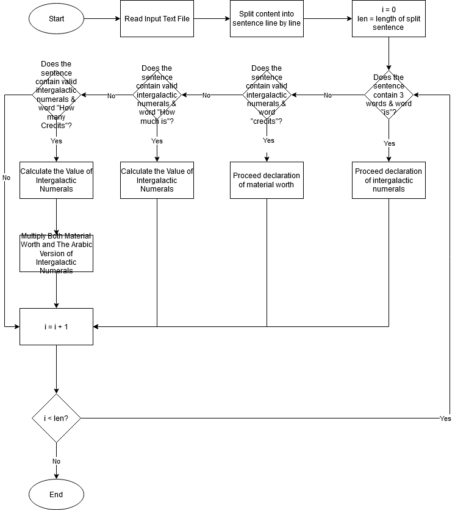

# galaxy-merchant-trading #
An application to convert intergalactic numerals to become understandable

## Problem Description ##
You decided to give up on earth after the latest financial collapse left 99.99% of the earth's
population with 0.01% of the wealth. Luckily, with the scant sum of money that is left in your
account, you are able to afford to rent a spaceship, leave earth, and fly all over the galaxy to sell
common metals and dirt (which apparently is worth a lot). Buying and selling over the galaxy
requires you to convert numbers and units, and you decided to write a program to help you.The
numbers used for intergalactic transactions follows similar convention to the roman numerals and
you have painstakingly collected the appropriate translation between them. Roman numerals are
based on seven symbols: 

Symbol Value<br/>
I 1<br/>
V 5<br/>
X 10<br/>
L 50<br/>
C 100<br/>
D 500<br/>
M 1,000<br/>

Numbers are formed by combining symbols together and adding the values. For example, MMVI is
1000 + 1000 + 5 + 1 = 2006. Generally, symbols are placed in order of value, starting with the
largest values. When smaller values precede larger values, the smaller values are subtracted from
the larger values, and the result is added to the total. For example MCMXLIV = 1000 + (1000 −
100) + (50 − 10) + (5 − 1) = 1944. 

The symbols "I", "X", "C", and "M" can be repeated three times in succession, but no more. (They
may appear four times if the third and fourth are separated by a smaller value, such as XXXIX.)
"D", "L", and "V" can never be repeated

"I" can be subtracted from "V" and "X" only. "X" can be subtracted from "L" and "C" only. "C" can
be subtracted from "D" and "M" only. "V", "L", and "D" can never be subtracted. 

Only one small-value symbol may be subtracted from any large-value symbol. 

A number written in Arabic numerals can be broken into digits. For example, 1903 is composed of
1, 9, 0, and 3. To write the Roman numeral, each of the non-zero digits should be treated separately.
In the above example, 1,000 = M, 900 = CM, and 3 = III. Therefore, 1903 = MCMIII.
Source: Wikipedia (http://en.wikipedia.org/wiki/Roman_numerals)

### Test Input ###
```
glob is I  
prok is V  
pish is X  
tegj is L  
glob glob Silver is 34 Credits  
glob prok Gold is 57800 Credits  
pish pish Iron is 3910 Credits  
how much is pish tegj glob glob ?  
how many Credits is glob prok Silver ?  
how many Credits is glob glob Gold ?  
how many Credits is glob glob glob glob glob glob Gold ?  
how many Credits is pish tegj glob Iron ?
Does pish tegj glob glob Iron has more Credits than glob glob Gold ?
Is glob prok larger than pish pish ?
how much wood could a woodchuck chuck if a woodchuck could chuck wood ?  
```

### Expecting Output ###
```
pish tegj glob glob is 42  
glob prok Silver is 68 Credits  
glob glob Gold is 28900 Credits 
Requested number is in invalid format
pish tegj glob Iron is 8015.5 Credits
pish tegj glob glob Iron has less Credits than glob prok Gold
glob prok is smaller than pish pish
I have no idea what you are talking about 
```

## Solution ##

### Flow Chart ###


### System Requirement ###
Best performance in Go 1.13

### How to Setup ###
Download or Git Clone the repository
```Download or Git Clone
$ git clone https://github.com/jojiejo/galaxy-merchant-trading.git
```

Run the source code
```Run the source code
$ cd galaxy-merchant-trading
$ go mod tidy
$ go run main.go
```

Or you can build the source code (Then execute main.exe after successfully builded)
```Build the source code
$ cd galaxy-merchant-trading
$ go mod tidy
$ go build main.go
```